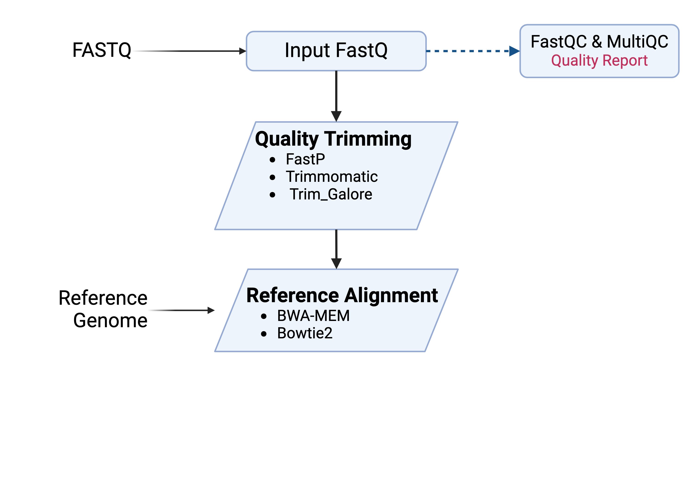

# VariantCalling_Pipeline
Materials and resourses for the ACE Cancer Genomics Working Group Variant Calling Pipeline

## Nextflow Resources
- https://www.nextflow.io/docs/latest/index.html
- https://pipelines.tol.sanger.ac.uk/ Here is the link for the pipelines on sanger
(https://github.com/sanger-tool) thats the github repository

## Known Dependencies:
- [FastQC](https://github.com/s-andrews/FastQC)
- [MultiQC](https://github.com/MultiQC/MultiQC)
- [Trim Galore](https://github.com/FelixKrueger/TrimGalore/blob/master/Docs/Trim_Galore_User_Guide.md)
- [Trimmomatic](https://github.com/usadellab/Trimmomatic)
- [FastP](https://github.com/OpenGene/fastp)
- [BWA-MEM](https://github.com/lh3/bwa)
- [Bowtie2](https://github.com/BenLangmead/bowtie2)
- 

